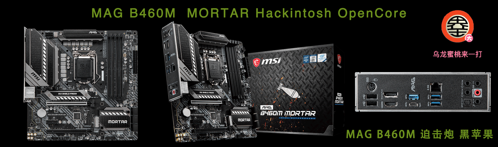
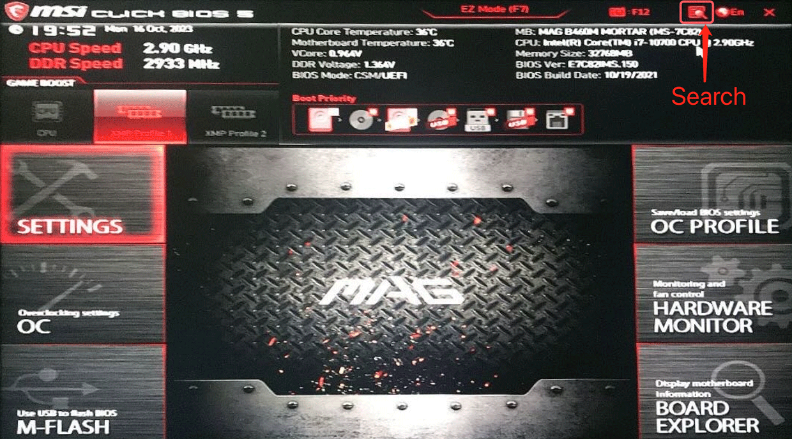
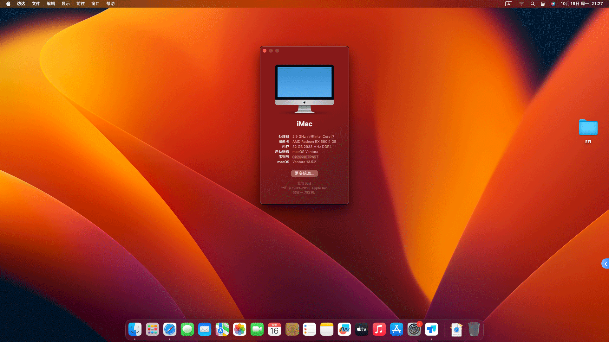

## MAG B460M MORTAR Hackintosh OpenCore EFI



### [简体中文](https://github.com/hackintosh-club/MAG-B460M-MORTAR-OpenCore)


### OpenCore

[OpenCore 1.0.2](https://github.com/acidanthera/OpenCorePkg)


### macOS

- Sequoia  （Intel & Broadcom WiFi Need [OCLP](https://github.com/dortania/OpenCore-Legacy-Patcher/releases/tag/2.0.2) Patch）
- Sonoma  （Broadcom WiFi Need [OCLP](https://github.com/dortania/OpenCore-Legacy-Patcher/releases/tag/2.0.2) Patch）
- Ventura
- Monterey


### Spec

- Chipset: B460
- BIOS: 7C82v15 2021-10-18
- CPU: Intel 10th i7-10700
- Memo: CORSAIR 16GB*2 DDR4 3200Mhz
- SSD: Western Digital SN750 500GB MacOS
- GPU: Sapphire Radeon RX 560 4GB GDDR5 1024SP
- HDA: Realtek ALCS1200A
- LAN: Realtek RTL8125 Gaming  2.5GbE
- WLAN: fenvi FV-T919（BCM94360CD）
- CPU COOLING: CoolerMaster T400i
- MONITOR: DELL U2422HX
- CASE:  Phanteks P300
- PSU:  FOCUS GC550W 80 Gold


### BIOS

```
Settings
  |-- Security
     |-- Secure Boot
       |-- Secure Boot: Disabled
       
Search
  |-- D.T.M
    |-- D.T.M: Enabled
```




### ScreenShot



### Notes

 - Use [OCAuxiliaryTools](https://github.com/ic005k/OCAuxiliaryTools) build your SMBIOS


### Tools

- [Hackintool](https://github.com/headkaze/Hackintool) 
- [OCAuxiliaryTools](https://github.com/ic005k/OCAuxiliaryTools) AKA `OCAT`.
- [OpenCore Configurator](https://mackie100projects.altervista.org/opencore-configurator/) AKA `OCC`.
- [gibMacOS](https://github.com/corpnewt/gibMacOS) Build your own MacOS image.
- [ProperTree](https://github.com/corpnewt/ProperTree) Plist editor.


### Contact Us

QQ Group: 23304408


