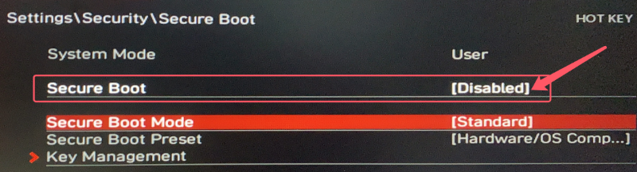

## MAG B460M MORTAR 黑苹果 OpenCore EFI


### [ENGLISH](README.EN.md)


### OpenCore

[OpenCore 1.0.0](https://github.com/acidanthera/OpenCorePkg)


### macOS

- Sonoma
- Ventura
- Monterey


### 硬件

- 芯片组: B460
- BIOS版本: 7C82v15 2021-10-18
- 处理器: 英特尔10代 i7-10700
- 内    存: 海盗船 16GB*2 DDR4 3200Mhz
- 硬    盘: 西部数据 SN750 500GB MacOS
- 显    卡: 蓝宝石  Radeon RX 560 4GB GDDR5 1024SP
- 声    卡: 瑞昱 ALCS1200A
- 有线网卡: 瑞昱 RTL8125 Gaming 2.5GbE
- 无线网卡: 奋威 FV-T919（BCM94360CD）
- 处理器散热: 酷冷至尊T400i
- 显示器:  戴尔U2422HX
- 机箱:  追风者P300
- 电源:  海韵 FOCUS GC550W 80 金牌


### BIOS设置

```
1.关闭安全启动
Settings
  |-- Security
     |-- Secure Boot
       |-- Secure Boot: Disabled

2.使用搜索功能查找并启用 D.T.M 
Search
  |-- D.T.M
    |-- D.T.M: Enabled

```




### 截图展示


### 注意事项

 - 安装成功后必须使用 [OCAuxiliaryTools](https://github.com/ic005k/OCAuxiliaryTools) 生成你自己的 SMBIOS


### 常用工具

- [Hackintool](https://github.com/headkaze/Hackintool) 
- [OCAuxiliaryTools](https://github.com/ic005k/OCAuxiliaryTools) AKA `OCAT`.
- [OpenCore Configurator](https://mackie100projects.altervista.org/opencore-configurator/) AKA `OCC`.
- [gibMacOS](https://github.com/corpnewt/gibMacOS) Build your own MacOS image.
- [ProperTree](https://github.com/corpnewt/ProperTree) Plist editor.


### 联系我们

QQ Group: 23304408


